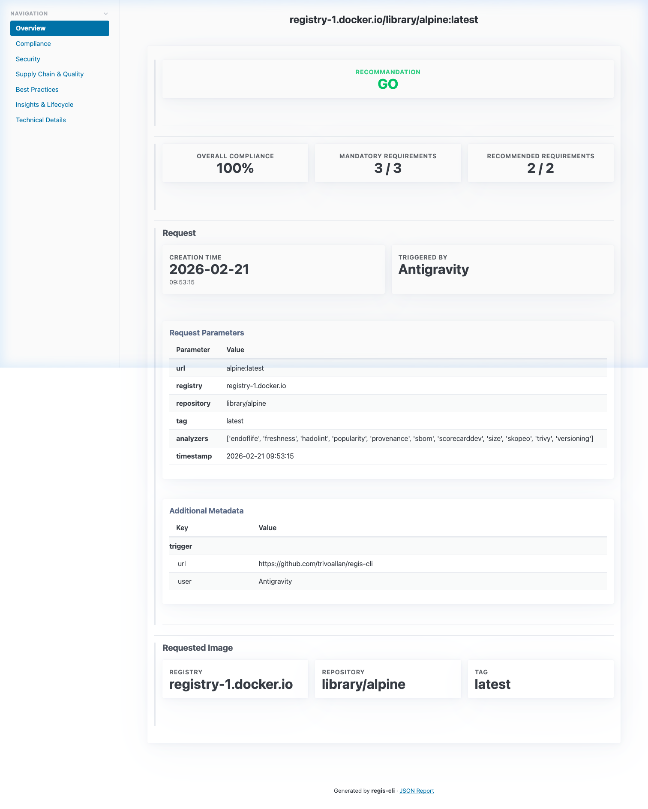
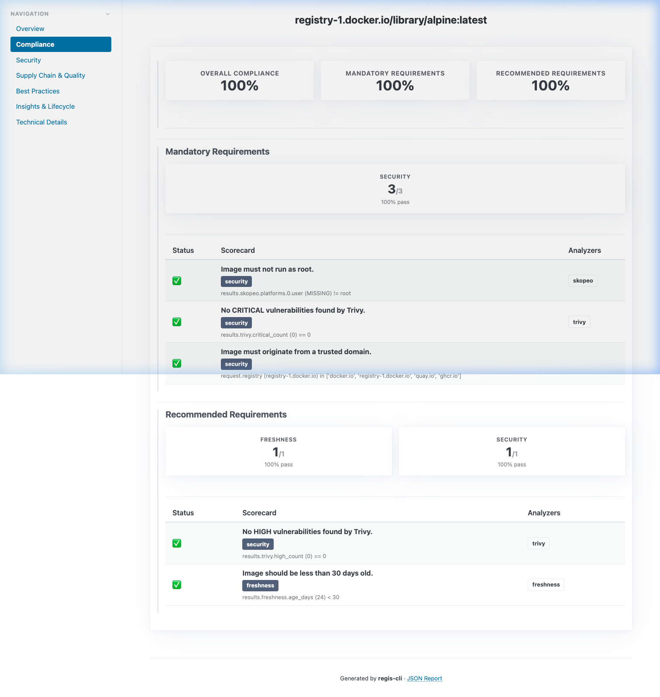
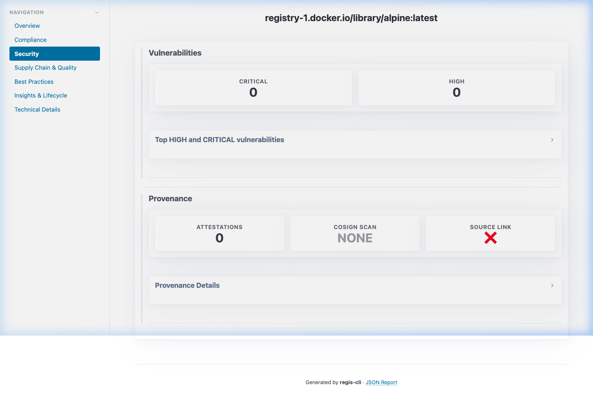
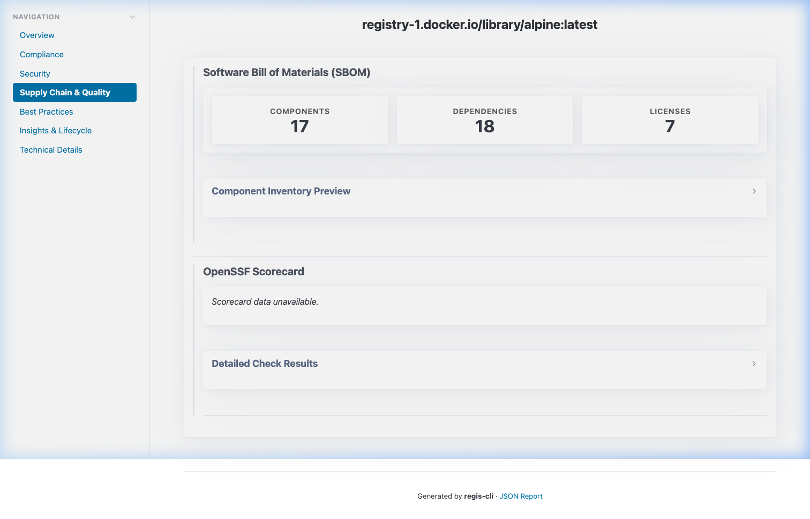
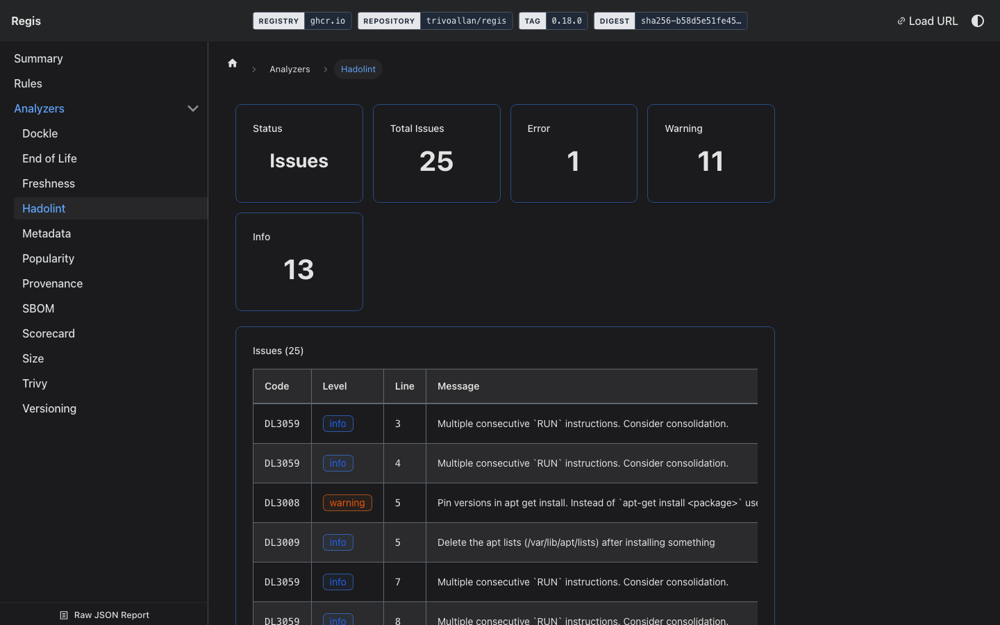
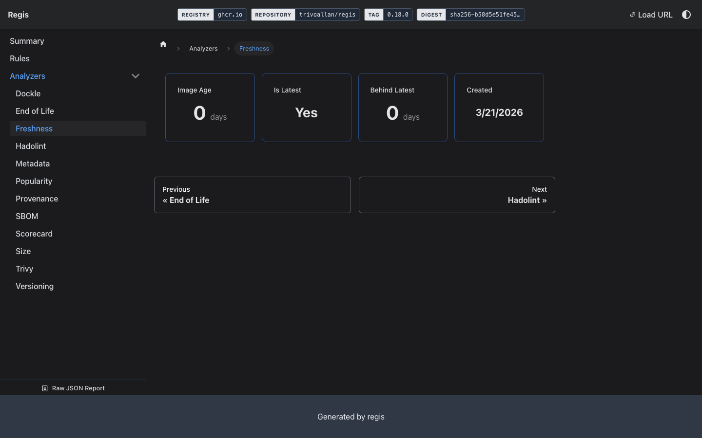
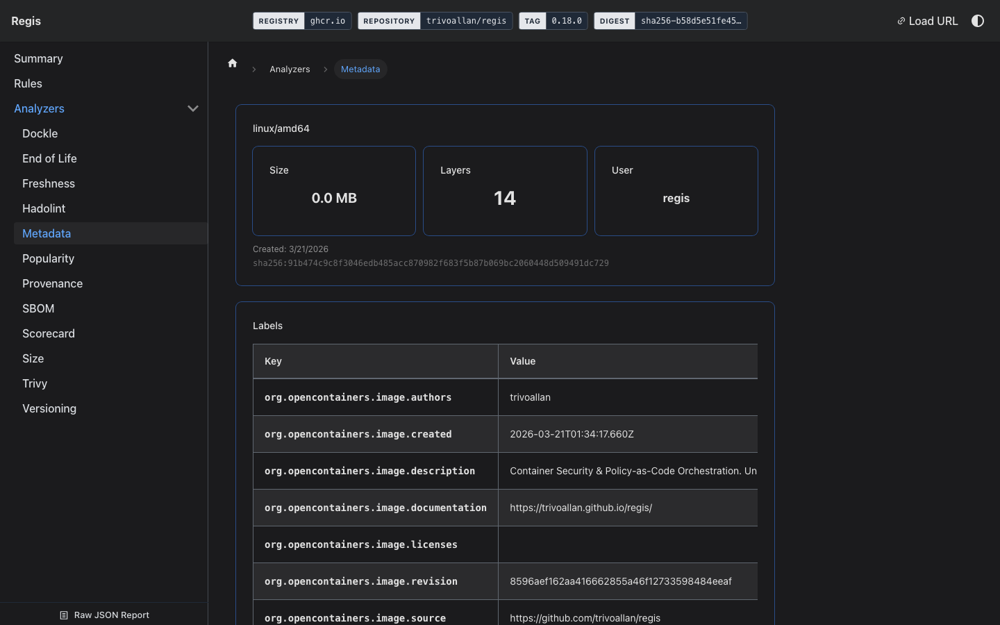

# Regis

> **Registry Scores** — Container Security & Policy-as-Code Orchestration

Regis provides unified container analysis, custom playbooks, and highly customizable interactive reports for production-ready CI/CD.

## Documentation

Comprehensive documentation, including installation and usage guides, is available at:
**[https://trivoallan.github.io/regis/](https://trivoallan.github.io/regis/)**

## Key Features

- **Unified Registry Inspection** — Fast, multi-arch metadata extraction from any OCI-compliant registry using [`skopeo`](/docs/reference/analyzers/skopeo).
- **[Pluggable Analyzer Ecosystem](/docs/reference/analyzers)** — Orchestrates industry-standard tools like [`Trivy`](/docs/reference/analyzers/trivy), [`Skopeo`](/docs/reference/analyzers/skopeo), [`Hadolint`](/docs/reference/analyzers/hadolint), and [`Dockle`](/docs/reference/analyzers/dockle) to gather comprehensive security insights.
- **[Policy-as-Code Playbooks](/docs/concepts/playbooks)** — Define compliance and security rules (e.g., "no critical vulnerabilities", "maximum image age") using flexible `jsonLogic` evaluations. [Learn more about custom playbooks](/docs/usage/custom-playbook).
- **[Hybrid Reporting](/docs/concepts/reports)** — Simultaneously generates machine-readable JSON for automation and rich, interactive HTML dashboards for human review. [Explore the report viewer](/docs/usage/report-viewer).
- **CI/CD Native** — Designed to integrate seamlessly into [GitHub Actions](/docs/usage/integrations/github) or [GitLab CI](/docs/usage/integrations/gitlab) pipelines with first-class support for MR/PR reporting.
- **Efficient Caching** — Reuse existing analysis results to speed up repeated evaluations and report regeneration.

## Built-in Analyzers

| Analyzer                                                 | Description                                                                            |
| -------------------------------------------------------- | -------------------------------------------------------------------------------------- |
| [`skopeo`](/docs/reference/analyzers/skopeo)             | Extracts multi-arch metadata, OS/Architecture labels, layers, and root user detection. |
| [`trivy`](/docs/reference/analyzers/trivy)               | Performs vulnerability scanning and generates Software Bill of Materials (SBOM).       |
| [`sbom`](/docs/reference/analyzers/sbom)                 | Dedicated SBOM analysis and CycloneDX/SPDX generation.                                 |
| [`provenance`](/docs/reference/analyzers/provenance)     | Verifies image build provenance and SLSA metadata.                                     |
| [`endoflife`](/docs/reference/analyzers/endoflife)       | Checks for End-Of-Life (EOL) status of base images using `endoflife.date`.             |
| [`freshness`](/docs/reference/analyzers/freshness)       | Calculates image age and identifies potential maintenance risks.                       |
| [`hadolint`](/docs/reference/analyzers/hadolint)         | Lints Dockerfiles for security and best practice violations.                           |
| [`dockle`](/docs/reference/analyzers/dockle)             | Container image linter for security and best practices.                                |
| [`size`](/docs/reference/analyzers/size)                 | Analyzes image size and layer distribution for optimization.                           |
| [`versioning`](/docs/reference/analyzers/versioning)     | Ensures semantic versioning consistency and tag validation.                            |
| [`popularity`](/docs/reference/analyzers/popularity)     | Registry metrics and community adoption analysis (optional).                           |
| [`scorecarddev`](/docs/reference/analyzers/scorecarddev) | OpenSSF Scorecard integration for supply chain security.                               |

---

## Report Preview

`regis` generates high-quality, interactive HTML dashboards.
Below is a preview of the different sections available in a standard report.

**[Explore the interactive Alpine example report here](/docs/examples/playbooks/default/alpine/)**

📈 Dashboard Overview

 

✅ Compliance Analysis

 

🛡️ Vulnerability & Security

 

🔗 Supply Chain & Quality

 

✨ Best Practices

 

💡 Insights & Lifecycle

 

⚙️ Technical Details

 

---

## License

MIT
