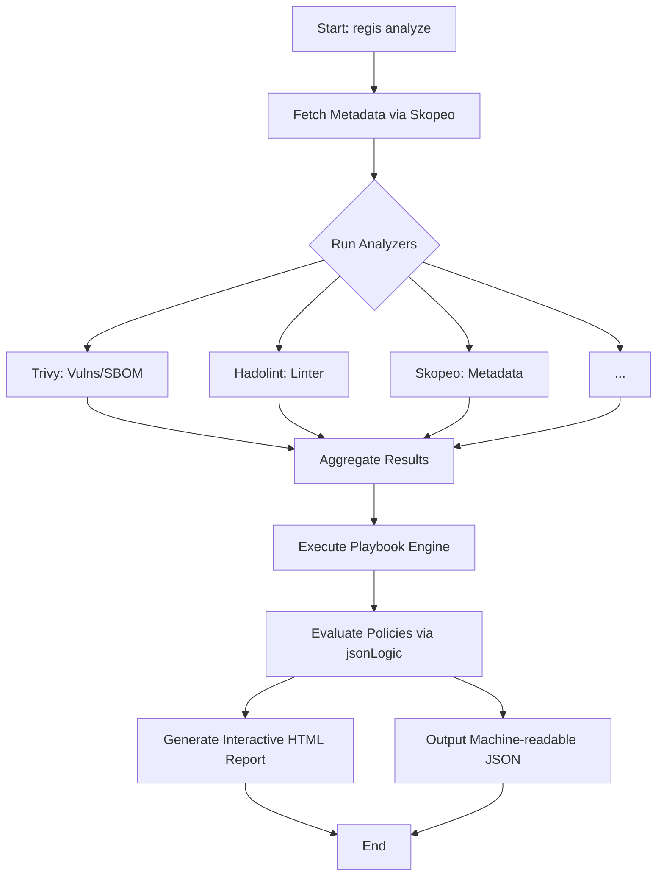

---
tags:
  - analyzers
---

# Analyzers

`regis-cli` uses a pluggable architecture where separate **Analyzers** are responsible for extracting specific types of data from container images or their build artifacts.

Each analyzer runs independently and contributes to a unified data model that is later evaluated against your [Playbooks](./playbooks.md).

## Core Analyzers

:::info[Reference]
RegiS includes several built-in analyzers.
For a complete list and technical details for each, see the [Analyzers Reference](../reference/analyzers/).
:::

- **Skopeo**: Fetches low-level image metadata (labels, architecture, layers, creation date) directly from the registry.
- **Trivy**: Performs vulnerability scanning (CVEs) and generates Software Bill of Materials (SBOM).
- **Hadolint**: Lints Dockerfiles to ensure best practices and security standards are met.
- **Freshness**: Calculates the "age" of an image relative to its base image and updates.
- **End-Of-Life (EOL)**: Checks if the base OS or language runtime is approaching its end of support.
- **Popularity**: (Optional) Analyzes registry metrics to gauge community adoption.

## How it works

Below is the step-by-step process `regis-cli` follows when analyzing an image:

1. **Extraction**: The CLI invokes the configured analyzers.
2. **Normalization**: Results from different tools (JSON, text, etc.) are normalized into a standard `regis` format.
3. **Context Injection**: This data becomes the "Context" for rule evaluation.

:::tip
You can enable or disable specific analyzers via the CLI flags or the configuration file to speed up analysis if you only need specific data.
:::
