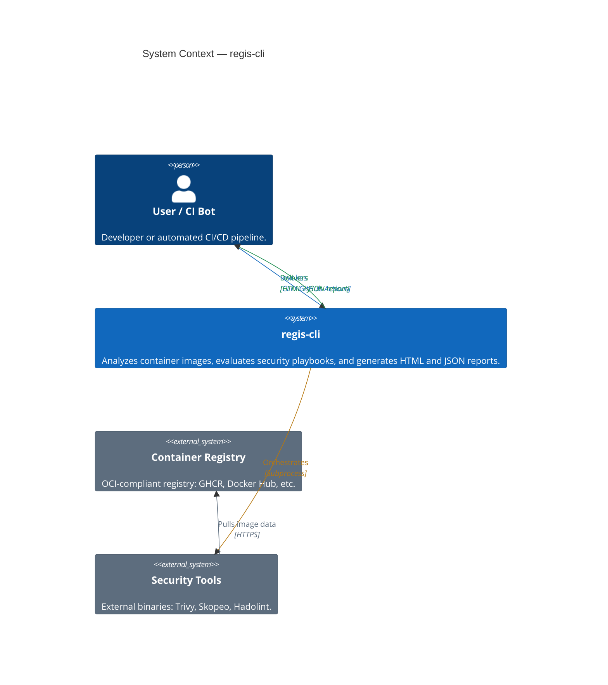
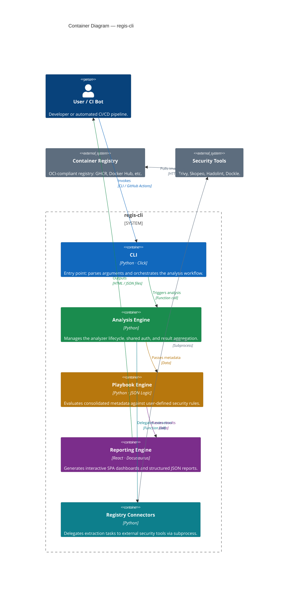

# Introduction

`regis-cli` is a command-line tool designed to analyze container image registries, evaluate security playbooks, and generate comprehensive reports. It provides deep visibility into container image metadata and security posture, enabling automated policy enforcement in CI/CD environments.

## Purpose

You use `regis-cli` to:

- Analyze multi-architecture container images.
- Evaluate custom security and compliance rules using JSON logic.
- Generate human-readable HTML reports and machine-readable JSON reports.
- Integrate security checks into GitHub Actions or GitLab CI pipelines.

## Architecture

`regis-cli` uses a modular, pluggable architecture that separates data extraction from policy evaluation and reporting.

### Container View

## Core Components

The following sections describe the primary components of the `regis-cli` system.

### CLI Layer

The command-line interface, built with the `Click` library, handles user input, argument parsing, and command orchestration. It serves as the primary entry point for both manual use and CI/CD integration.

### Analysis Engine

The analysis engine orchestrates the execution of pluggable analyzers. It manages common resources, such as registry authentication and caching, ensuring that analyzers can focus on extracting specific metadata.

### Analyzers

Analyzers are modular components responsible for gathering data from registries or local files. Current built-in analyzers include:

- **Skopeo**: Extracts multi-architecture metadata, labels, and layer information. ([Schema](../reference/schemas/analyzer/skopeo.schema.md))
- **Trivy**: Generates Software Bill of Materials (SBOM) and performs vulnerability scanning. ([Schema](../reference/schemas/analyzer/trivy.schema.md))
- **Hadolint**: Lints Dockerfiles for best practices. ([Schema](../reference/schemas/analyzer/hadolint.schema.md))
- **Dockle**: Container image linter for security and best practices. ([Schema](../reference/schemas/analyzer/dockle.schema.md))
- **Versioning**: Validates semantic versioning consistency. ([Schema](../reference/schemas/analyzer/versioning.schema.md))
- **Freshness**: Calculates image age. ([Schema](../reference/schemas/analyzer/freshness.schema.md))

### Playbook Engine

The playbook engine evaluates consolidated analyzer results against user-defined rules. These rules use `jsonLogic` to define complex conditional logic for security and compliance checks, such as "no critical vulnerabilities" or "maximum image age."

### Reporting Layer

The reporting layer transforms the analysis and playbook results into high-quality, actionable formats.
It leverages a modern **Single Page Application (SPA)** architecture built with **Docusaurus and React** to produce rich, interactive dashboards for human review. It also generates structured JSON (see [Report Schema](../reference/schemas/report/report.schema.md)) for automated processing.

## Technology Stack

The project uses the following technologies:

- **Language**: Python 3.13+
- **Dependency Management**: Pipenv
- **CLI Framework**: Click
- **Templating**: Jinja2 (Data) & Docusaurus/React (UI)
- **Linting/Formatting**: Ruff
- **External Tools**: Skopeo, Trivy, Hadolint, Dockle
- **Testing**: Pytest
- **CI/CD**: GitHub Actions, Release Please, Super-Linter
