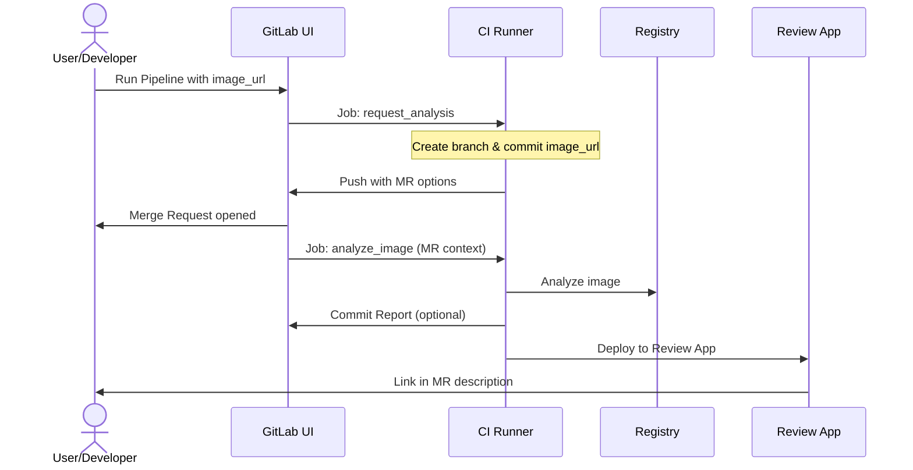

# GitLab CI

:description: Guide to using regis-cli in GitLab CI/CD pipelines.

This guide explains how to integrate `regis-cli` into your GitLab CI/CD pipelines to automate container image analysis and security scoring.

## Prerequisites

- A GitLab project.
- GitLab Runner with Docker executor.
- (Optional) `glab` CLI installed locally.

:::tip
To quickly bootstrap a new GitLab repository pre-configured with `regis-cli` and GitLab CI, you can use our [Project Bootstrapping](../commands.md#bootstrap) command.
:::

## GitLab CI Configuration

The generated `.gitlab-ci.yml` uses GitLab CI `spec: inputs` to parameterize the image analysis.

```yaml
include::example$gitlab-ci-fragment.yml[]
```

:::note
In GitLab CI, the workspace is automatically available. The template uses a `before_script` to symlink workspace directories to the `/app/playbooks` and `/app/reports` paths expected by the `regis-cli` container.
:::

## Running Analysis

Once pushed, you can trigger an analysis manually from the GitLab UI:

1. Go to **Build > Pipelines**.
2. Click **Run pipeline**.
3. Enter the `image_url` input.
4. Click **Run pipeline**.

## Publishing to GitLab Pages

`regis-cli` reports are perfectly suited for GitLab Pages. In GitLab CI, any files placed in a directory named `public` at the end of a job named `pages` will be automatically published.

### Deployment Job

Add the following job to your `.gitlab-ci.yml`:

```yaml
pages:
  stage: deploy
  script:
    - mkdir -p public
    - cp -r reports/* public/
  artifacts:
    paths:
      - public
  only:
    - main
```

The analysis results will be accessible at `https://<your-namespace>.gitlab.io/<your-project-slug>/`.

## Report Versioning

To keep a history of your analysis reports directly in the Git repository, you need to configure a **Project Access Token**:

1. Go to **Settings > Access Tokens**.
2. Create a new token with:
   - **Name**: `GITLAB_TOKEN`
   - **Scopes**: `write_repository`
3. Copy the token.
4. Go to **Settings > CI/CD > Variables**.
5. Add a variable named `GITLAB_TOKEN`, paste the token value, and ensure it is **masked**.

When this variable is present, the CI pipeline will automatically commit and push new reports to your branch.

## Adding CI Metadata

You can enrich your reports with GitLab CI metadata using the `--meta` flag. The default playbook uses the following well-known keys:

- `trigger.user`: The user who initiated the analysis (e.g., `$GITLAB_USER_LOGIN`).
- `trigger.url`: A link to the CI job (e.g., `$CI_JOB_URL`).

```bash
regis-cli analyze <image-url> \
  --meta "trigger.user=$GITLAB_USER_LOGIN" \
  --meta "trigger.url=$CI_JOB_URL"
```

## Self-Service Analysis Workflow

This workflow allows authorized users to request a one-off image analysis directly from the GitLab UI.

### Prerequisites

To enable this workflow, you must configure a **Project Access Token** (or Personal Access Token) as a GitLab CI/CD variable:

- **Variable Name**: `GITLAB_TOKEN`
- **Scopes**: `api`, `write_repository`
- **Role**: `Developer` (minimum)
- **Protection**: Ensure the variable is **not protected** (or protect the `regis/analyze/*` branch pattern), as it needs to be accessible by pipelines running on dynamically created analysis branches.

### Request-to-MR Flow

The unified GitLab template supports a full "Self-Service" workflow where any user can request an image analysis via a pipeline input. This creates a focused Merge Request with a dedicated report deployed to a Review App.



### 1. Trigger the Request

Go to **Build > Pipelines > Run pipeline**, enter the `image_url`, and run.

### 2. Merge Request Creation

The pipeline automatically creates a new branch and a Merge Request.
The MR description contains instructions to find the **Analysis Report** within the committed \`reports/\` directory or the exposed artifacts.

### 3. Report Inspection

Once the analysis job completes, the pipeline runs the `push_results` reporting job:

- **`push_results`**: Commits the `reports/` directory back to the branch, posts an MR comment with a direct report link, updates the MR description to include the link and any review checklists, and applies scoped GitLab labels based on your playbook configuration. Checklist items defined with `check_if` conditions may render pre-checked when those conditions pass, and items can be conditionally included via `show_if` conditions.

### 4. Governance

Security teams can review the MR, check the compliance score via the direct HTML report link, and decide whether to merge the analysis request into the main registry branch.

## Automated Labeling and Governance

The `regis-cli` integration automatically applies **scoped labels** to the Merge Request based on the analysis results and your playbook configuration.

### Badge Synchronization

Instead of defining complex conditions for labels, `regis-cli` can automatically synchronize its **Badges** as GitLab labels.

In your `playbook.yaml`, you simply list the badge slugs you want to import under the `integrations.gitlab.badges` section:

```yaml
integrations:
  gitlab:
    badges:
      - score
      - freshness
      - cve-critical
      - cve-high
```

This ensures that:

1. Only the relevant status indicators are applied as labels.
2. The color and text of the GitLab label match the badge's visual state (Success=Green, Warning=Yellow, Error=Red, Info=Blue).

GitLab scoped labels (using the `::` separator) ensure that only one label of a given scope (e.g., `regis::*`) is applied at a time.

### Integration with Approval Rules

These labels can be used to drive **GitLab Approval Rules** (Premium/Ultimate). You can configure your project settings to require specific approvals when certain labels are present.

- **Example**: Require `@security-team` approval if the `security::critical` label is applied.
- **Workflow**:
  1.  User requests analysis.
  2.  `regis-cli` finds a critical vulnerability.
  3.  Pipeline applies `security::critical` label via the GitLab API.
  4.  GitLab Approval Rule detects the label and blocks the Merge Request until a security officer approves it.

### MR Description Checklists

The `regis-cli` integration can also append review checklists to the Merge Request description based on your playbook configuration. This allows you to define manual or automated verification steps directly in the Merge Request.

This is driven by the `integrations.gitlab.checklists` section in your playbook. You can dynamically include items using `show_if` conditions, and automatically pre-check them using `check_if` conditions.
:::tip
For more details on configuring checklist items, see the [Playbooks Reference](playbooks.md#_mr_description_checklists).
:::

## Review Apps (Premium/Ultimate Only)

If you are using a **GitLab Premium** or **Ultimate** tier, you can take advantage of parallel GitLab Pages deployments to host a live "Review App" for every Merge Request instead of relying on raw artifacts.

To enable this, update your `.gitlab-ci.yml`:

```yaml
pages:
  stage: deploy
  script:
    - echo "Publishing report..."
  artifacts:
    paths:
      - reports/
  pages:
    path_prefix: "$PAGES_PREFIX"
  rules:
    - if: $CI_MERGE_REQUEST_IID
      variables:
        PAGES_PREFIX: "review-$CI_MERGE_REQUEST_IID"
    - if: $CI_COMMIT_BRANCH == $CI_DEFAULT_BRANCH
      variables:
        PAGES_PREFIX: ""
```

This configuration generates a unique URL for each Merge Request (e.g., `https://<namespace>.gitlab.io/<project>/review-123/`).

## Registry Authentication

To avoid rate limits on public registries (like Docker Hub) or to analyze images from private registries, you can configure authentication using several methods.

The following environment variables can be set in **Settings > CI/CD > Variables**:

### 1. Docker Config (Recommended)

Set `DOCKER_AUTH_CONFIG` to a JSON string matching the content of a standard `~/.docker/config.json`. This is the standard GitLab method for runner authentication.

```json
{
  "auths": {
    "https://index.docker.io/v1/": {
      "auth": "base64(username:password)"
    }
  }
}
```

### 2. regis-cli Specific Variables

You can set domain-specific or global variables:

- `REGIS_AUTH_<DOMAIN>_USERNAME` & `REGIS_AUTH_<DOMAIN>_PASSWORD`: (e.g., `REGIS_AUTH_DOCKER_IO_USERNAME`).
- `REGIS_USERNAME` & `REGIS_PASSWORD`: Global fallback for all registries.

### 3. Standard Environment Variables

`regis-cli` also supports standard Docker Cloud/Hub environment variables for `docker.io` registry:

- `DOCKER_HUB_USERNAME` & `DOCKER_HUB_PASSWORD`
- `DOCKER_USERNAME` & `DOCKER_PASSWORD`
