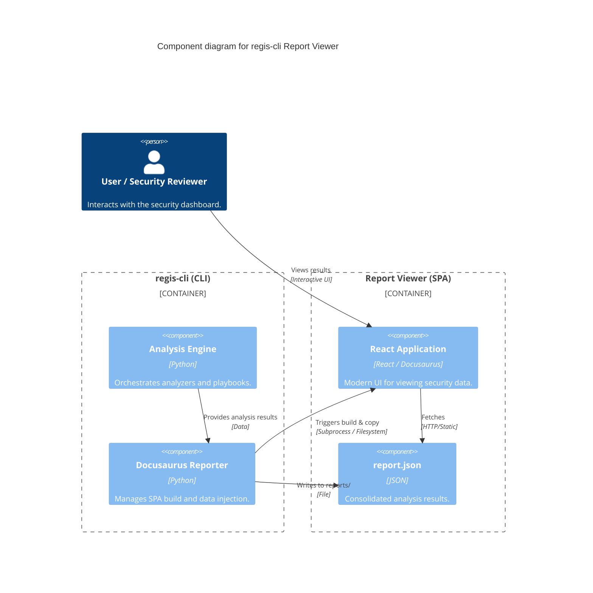

---
tags:
  - reports
  - dashboard
---

# Report Viewer

The `regis-cli` Report Viewer is a modern, interactive Single Page Application (SPA) designed to transform complex security data into clear, actionable insights.

## Architecture

The following diagram illustrates how `regis-cli` generates and serves the interactive report:



## Features

- **Dashboard Overview**: Get a high-level summary of your image's security posture and compliance status at a glance.
- **Interactive Vulnerability Explorer**: Filter, sort, and search through findings from analyzers like Trivy and Hadolint.
- **Compliance Tracking**: Visualize how your image stacks up against your custom playbooks and industry best practices.
- **Deep Technical Insights**: Drills down into layer distribution, SBOM details, and registry metadata.
- **Self-Contained**: The report is fully portable and can be served from any static web server (GitHub Pages, GitLab Pages) or viewed as a CI/CD artifact.

## Report Sections

### 📈 Dashboard Overview

The flagship view providing a holistic summary of the image, including its compliance score, primary badges, and high-level metadata.

### ✅ Compliance Analysis

A detailed breakdown of every rule evaluated by your playbooks. Each rule displays its status (Passed/Failed), its importance (Level), and a clear functional description.

### 🛡️ Vulnerability & Security

Aggregated security findings from specialized analyzers. This section provides detailed tables for CVEs, including severity, fixed versions, and direct links to vulnerability databases.

### 🔗 Supply Chain & Quality

Insights into the image's origin, including SBOM (Software Bill of Materials), provenance data, and SLSA compliance levels.

### ✨ Best Practices

Automated checks for Dockerfile best practices and common security pitfalls (e.g., running as root, using unsafe instructions).

### 💡 Insights & Lifecycle

Information about image freshness, End-Of-Life (EOL) status for base images, and maintenance risks.

### ⚙️ Technical Details

Raw metadata and layer-by-layer analysis for deep troubleshooting and size optimization.

## Interactivity

The report viewer is designed for high-performance interaction:

- **Instant Filtering**: Narrow down results by severity, analyzer, or pass/fail status.
- **Search**: Quickly find specific rules or vulnerabilities.
- **Detailed Modals**: Click on any finding to see a comprehensive breakdown of the issue and remediation tips.

## Hosting & Deployment

To generate the HTML report site, use the `--site` (or `-s`) flag:

```bash
regis analyze <image-url> --site
```

### Static Hosting

Upload the contents of the `reports/` directory to any static hosting service like GitHub Pages or S3.

### GitLab Artifacts

If you are using our standard GitLab CI template, the report is automatically exposed as a GitLab artifact.

:::important
Because the report is an SPA, it requires a correct `baseUrl` if hosted at a non-root path. Ensure you use the `--base-url` flag in your CI pipeline.
:::

```bash
regis analyze <image-url> --site --base-url "/my-subpath/"
```
