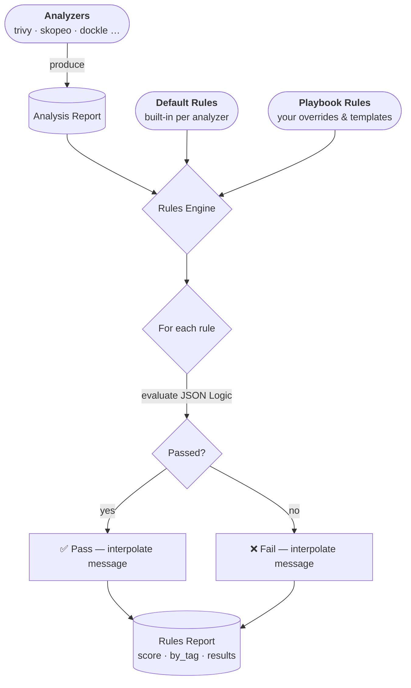

---
tags:
  - rules
---

# Rules

Rules are the evaluation heart of RegiS. Each rule defines a specific condition that the analysis results must satisfy, together with a severity level, interpolated messages, and optional parameters.

## How Rules Work



When `regis-cli` runs an analysis, the rules engine:

1. **Collects default rules** from every analyzer that participated in the run.
2. **Merges playbook rules** on top — overriding defaults or instantiating new rule instances from templates.
3. **Evaluates** each active rule against the analysis report using [JSON Logic](https://jsonlogic.com/).
4. **Interpolates** pass/fail messages with live report values.
5. **Produces** a scored rules report.

## Built-in Default Rules

Each analyzer ships its own built-in rules that are automatically activated when that analyzer runs. You do not need to declare them in your playbook to benefit from them.

:::tip
For the full list of standard rules, their parameters, and condition details, see the
[Rules Reference](../reference/rules/).
:::

You can inspect them at any time from the CLI:

```bash
# List all default rules (table)
regis-cli rules list

# Show the full definition of a specific rule
regis-cli rules show trivy cve-count
```

## Customizing Rules in a Playbook

Add a top-level `rules` list to your `playbook.yaml` to override defaults, instantiate templates, or define brand-new rules.

### Overriding a Default Rule

Match a default rule by its `provider` and `rule` (slug) to change its level, parameters, or messages:

```yaml
rules:
  # Demote critical CVE rule to a warning
  - provider: trivy
    rule: fix-available
    level: warning
    messages:
      fail: "${results.trivy.fixed_count} patchable vulnerabilities found — please fix soon."

  # Disable a rule entirely
  - provider: skopeo
    rule: platforms-count
    enable: false

  # Restrict to your private registry only
  - provider: core
    rule: registry-domain-whitelist
    options:
      domains: ["my-private-registry.example.com"]
```

### Instantiating Rule Templates

Some rules are **templates**: they are designed to be instantiated multiple times with different parameters. Use `provider` + `rule` + `options` to create a named instance:

```yaml
rules:
  # Block any critical CVEs
  - provider: trivy
    rule: cve-count
    options:
      level: critical
      max_count: 0

  # Allow up to 10 high-severity CVEs
  - provider: trivy
    rule: cve-count
    slug: trivy-high-tolerance # optional: give your instance a custom slug
    options:
      level: high
      max_count: 10
```

When no `slug` is provided, the engine generates one automatically from the template name and the `level` option (e.g. `cve-count.critical`).

:::note
Template rules — such as `trivy/cve-count`, `hadolint/severity-count`, or `dockle/severity-count` — are multi-purpose. Rather than shipping one hard-coded rule per severity, a single template can be instantiated as many times as you need.
:::

### Adding a Fully Custom Rule

You can define completely new rules with arbitrary JSON Logic conditions:

```yaml
rules:
  - slug: company-label-required
    description: Image must carry the company owner label.
    level: critical
    tags: [compliance]
    condition:
      "in":
        [
          "my-company.owner",
          { "keys": [{ "var": "results.skopeo.platforms.0.labels" }] },
        ]
    messages:
      pass: "Company label is present."
      fail: "Missing 'my-company.owner' label."
```

## Rule Evaluation Mechanics

### JSON Logic Conditions

Rule conditions are expressed as [JSON Logic](https://jsonlogic.com/) objects. The evaluation context exposes the full, flattened analysis report.

RegiS adds several custom operators on top of the standard set:

| Operator       | Description                                                      |
| :------------- | :--------------------------------------------------------------- |
| `intersects`   | `true` if any element of list _a_ is present in list _b_.        |
| `contains_all` | `true` if all elements of list _b_ are present in list _a_.      |
| `subset`       | `true` if all elements of list _a_ are also in list _b_.         |
| `keys`         | Returns the keys of a dictionary.                                |
| `get`          | Gets a value from a dictionary by a computed key.                |
| `env_contains` | `true` if any string in _b_ is a substring of any string in _a_. |

The current rule definition is always accessible under `rule.*` (e.g. `{\"var\": \"rule.params.max_count\"}`).

### String Interpolation

Pass and fail messages support `${path.to.var}` interpolation against the same evaluation context:

```yaml
messages:
  pass: "Image is ${results.freshness.age_days} days old — within the ${rule.params.max_days}-day limit."
  fail: "Image is ${results.freshness.age_days} days old (limit: ${rule.params.max_days})."
```

### Incomplete Rules

If the evaluation context is missing data that a condition accesses (e.g. an analyzer did not run), the rule is marked **`incomplete`** rather than `failed`. This prevents false negatives when an analyzer is simply not part of the current run.

## Evaluating Rules from the CLI

```bash
# Evaluate a report against the default rules
regis-cli rules evaluate report.json

# Use a custom playbook
regis-cli rules evaluate report.json --rules playbook.yaml

# Export results as JSON
regis-cli rules evaluate report.json -o rules_report.json
```

### Blocking CI/CD Pipelines

Use `--fail` to exit with a non-zero code when rules breach a given severity threshold:

```bash
# Fail the pipeline if any CRITICAL rule is breached
regis-cli rules evaluate report.json --fail

# Fail on WARNING or above
regis-cli rules evaluate report.json --fail --fail-level warning
```
