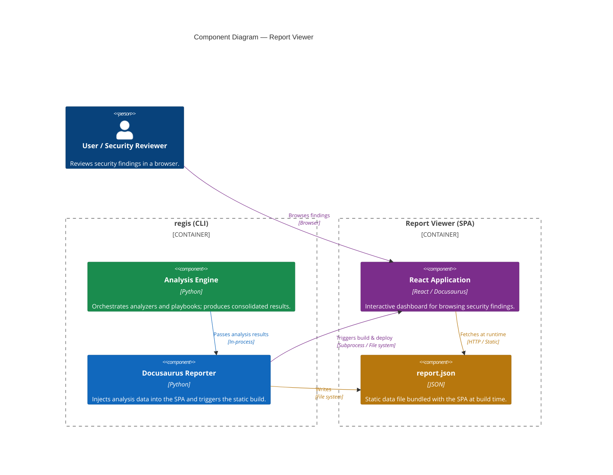

---
tags:
  - reports
---

# Reports

One of the core missions of `regis` is to bridge the gap between automated tools and human review through **Visual Excellence**.

## The Reporting Engine

`regis` uses a modern **Single Page Application (SPA)** architecture for its reports. Instead of static, server-side rendered pages, every report is a fully-featured, client-side application built with **React** and **Docusaurus**.

The following diagram illustrates the relationship between the CLI and the generated report:



This architecture allows for:

- **Rich Interactivity**: Instant filtering, sorting, and searching across thousands of vulnerability findings.
- **Unified Viewing Experience**: A consistent UI across different report types, with a polished, professional aesthetic.
- **Self-Contained Portability**: Each report is bundled into a single directory, ready to be served from any static host or viewed as a CI/CD artifact.

## Philosophy: Visual Excellence

We believe that security reports should be easy to read and aesthetically pleasing. A well-designed report:

1. **Reduces Cognitive Load**: Highlighting the most important issues first through clear categorization and visual cues.
2. **Encourages Adoption**: Teams are more likely to engage with security when given clear, actionable, and professional feedback.
3. **Facilitates Decision Making**: Using color-coded risk levels and intuitive navigation to distinguish between minor warnings and critical blockers.

## Hybrid Reporting

`regis` follows a "hybrid" reporting strategy:

- **JSON Report**: The source of truth. A machine-readable document containing all analysis and evaluation data, perfect for automated processing.
- **SPA Viewer**: A human-friendly dashboard that consumes the JSON report to provide a rich, interactive experience.

```bash
# Generate both JSON and interactive HTML site
regis analyze <image-url> --site
```

:::tip
Check our [Usage Guide](../usage/configuration.md) to learn how to set default themes for your project.
:::
